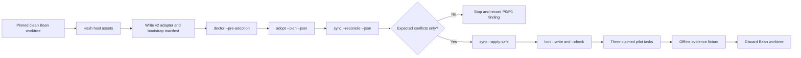

# TASK-AR-648 W0 T3 Replan

## Bottom Line

Proceed with a reversible Bean Wiki pilot, not with a production migration.
The pilot must test two competing facts:

1. Agent Runtime now has the common lifecycle controls Bean Wiki lacks:
   registered work, persisted claims, Compound, Scribe, continuity hooks,
   deterministic-first model routing, verification, and ownership-aware sync.
2. The pinned `core+web-content` projection is not yet demonstrably
   lightweight. It selects 243 files, 237 of them managed, while
   `web-content` contributes no file beyond `core`.

Bean Wiki is therefore the correct first consumer: it has a mature editorial
overlay and a clean safety boundary, so the pilot can reveal whether Runtime
adds useful governance without replacing product-specific expertise. A
release-blocking finding stops the v0.8 release lane and becomes registered
Runtime work; it is not converted into a prose-only caveat.

## T2 Drift

`plan_assumption_gate` reports 38 drift findings. They are the legitimate
result of completed TASK-AR-647: native Allimbot event production,
`security-service` policy/gates, profile closure, task schema, owner
governance, hook, package, documentation, and test surfaces all changed after
the last taskset snapshot.

That snapshot describes a pre-TASK-AR-647 Runtime and cannot authorize a
consumer pilot. This review replaces it. Re-record only the adoption,
ownership, continuity, Compound, Scribe, routing, pilot, and current profile
anchors relevant to TASK-AR-648 before dispatch.

## Pinned Baselines

| Repository | Baseline | Mutation boundary |
| --- | --- | --- |
| Agent Runtime | `main@e23ed65da8de8a9fe6305c3a6ca9955bb0e5c0fb` | W0 review first; implementation only after persisted claim |
| Bean Wiki | `origin/main@357eee4fd8c29c33a949adbe3a0ffa80c874bf42` | disposable clean worktree; no commit or push |
| Allimbot | `origin/main@5a51ed4b6c42b0fea1ac97352209f47ff52f3b52` | recipe read-only; no event enqueue or delivery |
| Autofolio | `ca88433cf155fd03d616584fda7ed4aa3d33fd71` | integration files read-only; dirty primary checkout untouched |

The dirty Agent Runtime, Bean Wiki, Autofolio, and Allimbot primary checkouts
are not pilot workspaces. All evidence comes from clean pinned worktrees or
read-only object inspection.

## Bean Wiki Host Harness

Bean Wiki already owns the domain-specific layer:

- `AGENTS.md` and `CLAUDE.md`;
- `docs/EDITORIAL.md` and `docs/AGENT-EDITORIAL-OPS.md`;
- eight editorial/persona agents under `.claude/agents/`;
- three article workflow skills under `.claude/skills/`;
- `BACKLOG.md` as canonical host state;
- `src/content/topic-plan.ts`;
- article validation, editorial validation, and generated-index workflows; and
- live editing/publishing code whose external effects must remain disabled.

At the pinned SHAs, only `AGENTS.md` and `CLAUDE.md` collide with selected
Agent Runtime template paths. Both currently default to `seed_once`; this
pilot declares them explicitly `host_owned` so ownership intent is
machine-readable. The other editorial assets do not collide with the template
but are also declared host-owned inputs and hashed before/after.

The specialist review uses `coffee-flavor-wheel.html`, corresponding to
topic-plan item `SEN-02`. It is read-only. The pilot must not turn a harness
test into an unresearched content change.

## Autofolio Lesson

Autofolio v0.6 established the useful architecture:

1. upstream framework files are managed;
2. product context is an additive host-owned overlay; and
3. unavoidable edits to managed files are explicit seams with a divergence
   ledger.

That architecture should be retained, but its accumulated v1 configuration
must not be copied. The inspected Autofolio config has 21 unmanaged paths,
including host state, Compound/report data, hooks, orchestration, governance,
taskset/wave dispatch, schema, and examples. Several are old upstream defects
or lifecycle ownership mismatches.

Bean Wiki instead uses v2 ownership, a canonical `agents/host/` context, a
state adapter, and zero implicit unmanaged paths. Any seam must be observed
from reconcile output and individually justified; the pilot cannot create a
bulk “ignore the harness” list merely to make sync green.

## Exact Host Adapter

The pilot config is equivalent to:

```yaml
schema: agent-runtime-config/v2
project: bean-wiki
upstream:
  package: agent_runtime
  remote_url: https://github.com/ycpiglet/agent_runtime.git
  ref: e23ed65da8de8a9fe6305c3a6ca9955bb0e5c0fb
sync:
  mode: check-diff-apply
  allow_silent_overwrite: false
profiles:
  - web-content
ownership:
  host_owned:
    - AGENTS.md
    - CLAUDE.md
    - BACKLOG.md
    - docs/EDITORIAL.md
    - docs/AGENT-EDITORIAL-OPS.md
    - .claude/agents
    - .claude/skills
    - agents/host
host:
  context: agents/host/HOST-CONTEXT.yml
  role_overlay: agents/host/ROLE-OVERLAY.yml
  state_adapters:
    backlog: BACKLOG.md
  state_projection: agents/project/state/SCRIBE-PROJECTION.json
```

`agents/host/HOST-CONTEXT.yml` maps Runtime roles to Bean Wiki's existing
editorial roles and links the editorial SSOT. `ROLE-OVERLAY.yml` remains
host-owned. The pilot records whether those declarations merely appear in
doctor output or actually reach session/dispatch context.

This distinction matters. Current code parses and reports `role_overlay`, but
no Runtime execution path consumes its content. The canonical host-context
document is similarly absent from the managed `AGENTS.md`, `CLAUDE.md`, and
SessionStart output. The pilot must classify this as an execution gap if no
other observed path carries it; configuration presence is not proof of
behavior.

## Footprint Hypothesis

The pinned profile matrix reports:

| Projection | Selected files | Increment over core |
| --- | ---: | ---: |
| `core` | 243 | 0 |
| `core+web-content` | 243 | 0 |
| `core+security-service` | 248 | 5 |
| full runtime | 248 | 5 |

The `core+web-content` top-level footprint is one hook config, four tool
guidance/seed files, 61 files under `agents/`, nine docs, three schemas, 149
scripts, eight skills, and supporting files. For Bean Wiki, 237 selected paths
default to managed and six to `seed_once`; the two existing collisions are
`AGENTS.md` and `CLAUDE.md`.

This is a measurement, not yet a defect verdict. The disposable pilot applies
the real projection and measures:

- file and byte growth;
- adoption duration;
- active versus unused installed capabilities;
- doctor and dependency closure;
- host-owned preservation;
- seams/conflicts;
- task trace coverage; and
- which installed controls are actually exercised.

If the common harness needs only a small subset, the finding should propose a
thin kernel plus optional governance, UI, collaboration, release, and
web-content layers. TASK-AR-648 does not silently redesign profiles while
collecting evidence.

## Adoption Sequence



`adopt` remains deliberately read-only. `sync --apply-safe` is the only
template application step. It refreshes the plan immediately before writing,
never writes unsafe symlink/non-regular targets, never writes `host_owned` or
`generated` paths, and returns nonzero while conflicts remain. The pilot
captures both the pre-apply reconcile and post-apply result.

The lock is written only after conflicts are zero. It must not “bless” an
unresolved host divergence.

## Bootstrap Provenance

Brownfield adoption has a bootstrap ordering problem: the host cannot use a
claim tool that has not been installed yet. The pilot solves this without
inventing an untracked exception:

1. `TASK-AR-648` and `UNIT-TASK-AR-648-001` are persisted and claimed in Agent
   Runtime before the Bean worktree is created.
2. The Bean adapter and first template application carry a bootstrap manifest
   with the upstream task, unit, claim, Runtime SHA, Bean base SHA, planned
   paths, and before/after tree digests.
3. After installation, every additional Bean diff is preceded by a local
   pilot task and claim.
4. Acceptance computes the union of bootstrap-owned and local-claim-owned
   paths. Any remaining diff fails.

Whether bootstrap provenance should become a first-class Runtime command is a
pilot finding. A fixture-only convention is not treated as a completed
product feature.

## Three Pilot Tasks

| Task | Work | Model policy | Allowed diff |
| --- | --- | --- | --- |
| `BEAN-PILOT-001` | inventory, plan, reconcile, apply, lock, doctor | deterministic preflight completes; no model call | config, host context, installed Runtime, bootstrap/task evidence |
| `BEAN-PILOT-002` | review `coffee-flavor-wheel.html` against Bean editorial SSOT | one selected specialist/reviewer route; observed execution recorded only if available | bounded local review/task evidence; no content diff |
| `BEAN-PILOT-003` | resume a claimed task from persisted checkpoint in a second process | deterministic process test; no model call | checkpoint, handoff, task/claim, Scribe/Compound evidence |

Roles reviewing one article run sequentially, matching Bean Wiki's editorial
operations rule. The task does not use a swarm, does not call a strong model
for inventory, and does not claim savings from tier names alone.

## Compound, Scribe, and Restart Proof

Compound evidence comes from an intentional negative test against a disposable
pilot fixture, such as a tampered host-owned digest. It records the observed
failure signature, prevention rule, verification, and task linkage. A later
matching query must return that exact record. No product defect or coffee fact
is fabricated.

Scribe reads `BACKLOG.md` through the configured state adapter, writes only
`agents/project/state/SCRIBE-PROJECTION.json`, and proves freshness by source
path and digest. `BACKLOG.md` must remain byte-identical.

Restart proof means two OS processes, not two calls inside one Python process:
the first persists a task claim and checkpoint, then exits; the second starts
from the same clean worktree and recovers the task, claim, next action, and
Scribe/Compound state. A direct manual invocation may prove the hook payload,
but the report must not claim that Codex Desktop reloaded a newly installed
hook unless that was actually observed.

## Model-Economy Truth

Every dispatch record separates:

- requested PM tier;
- selected PM tier and escalation reason;
- provider/execution surface;
- configured resolved model and reasoning effort;
- observed model and reasoning effort, if supplied by a completion record;
- deterministic-preflight result; and
- token/cost observations, if available.

`configured_unverified`, `unverified`, `ineffective_equivalent`, and
`unavailable` are valid outcomes. They are preferable to a false savings
claim. Inventory and restart are expected to end at
`completed_sufficient` with no model dispatch. The editorial review is the
only planned specialist model use.

## External-Effect Boundary

The following counters must be present and zero:

- live content publication;
- production or preview deployment;
- origin push;
- Bean consumer commit;
- credential/keyring/environment-secret read;
- Allimbot enqueue or flush;
- other network delivery; and
- mutation of either primary checkout.

Bean's build and validation commands are local. No OAuth, GitHub Contents API,
Vercel, Supabase, or Allimbot event operation is authorized.

## Offline Acceptance Fixture

Agent Runtime CI receives a sanitized fixture under
`tests/fixtures/pilots/bean-wiki`. It contains no article body, credential,
environment value, transcript, or absolute user path. It includes:

- pinned repository SHAs;
- before/after host-asset digests;
- profile/ownership/reconcile counts;
- bootstrap and local claim path maps;
- three task traces;
- Compound query and restart evidence;
- Scribe source/projection digests;
- routing intent and observation status;
- command return codes/output digests;
- duration/footprint metrics; and
- external-effect counters.

`scripts/pilot_acceptance.py` validates the fixture offline. Negative tests
must reject at least a changed host-owned digest, an unmapped diff, a claimed
observed model without observation evidence, a missing restart boundary, and
any nonzero external effect.

## Decision Gate

The pilot report classifies findings:

| Priority | Meaning |
| --- | --- |
| P0 | blocks v0.8 RC: unsafe overwrite, untraceable diff, broken closure, false model/cost evidence, external effect, or unusable adoption path |
| P1 | required before GA: excessive core footprint, host-context/role-overlay declarations not reaching execution, missing generic web-content control, bootstrap provenance not first-class |
| P2 | later usability/UI/automation improvement with a safe documented workaround |

Any P0 or release-essential P1 is registered as Agent Runtime work before
TASK-AR-651. The likely candidates are a thinner composable kernel, an
executable host-context/role adapter, a real generic `web-content` layer, and
a first-class brownfield bootstrap/apply command, but the pilot must decide
from evidence rather than pre-registering conclusions.

## Verification

```text
python -m pytest tests/test_adoption.py tests/test_config_v2.py \
  tests/test_inventory_sync_sanitize.py tests/test_model_routing.py \
  tests/test_scribe_due.py -q
python scripts/pilot_acceptance.py --host bean-wiki --check
python -m pytest tests/test_pilot_acceptance.py -q
```

Bean Wiki additionally runs `npm run build:content`, `npm run check-content`,
`npm run check:editorial`, and `git diff --check` when present. All commands,
return codes, and bounded output digests are evidence; no command may publish
or deploy.
